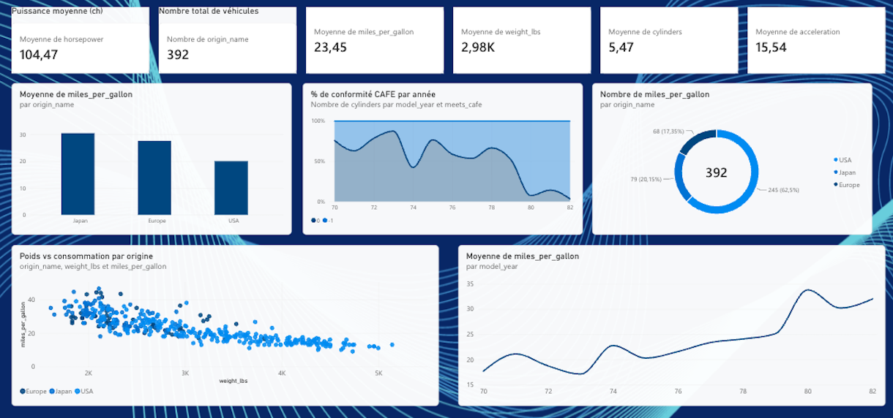

# Automobile Dataset Analysis

Analyse exploratoire et modélisation statistique d'un jeu de données de véhicules (consommation, puissance, poids, origine), avec un focus sur la conformité aux normes CAFE (24 mpg) et la prédiction de la consommation par régression.

## Démarche

1. **Nettoyage et statistiques descriptives** : variables quantitatives, répartition par origine géographique.
2. **Visualisations exploratoires** : distributions, comparaisons par origine, matrice de corrélations, pairplot.
3. **Analyse CAFE** : quels véhicules respectent le seuil de 24 mpg, et quelles caractéristiques les distinguent des autres.
4. **ACP** : standardisation, variance expliquée, projection 2D et contribution des variables, pour identifier les axes structurants du dataset.
5. **Régression polynomiale** : prédiction de la consommation, comparaison de plusieurs degrés de polynôme sur R² et erreur quadratique.

## Contenu du dépôt

```
src/
  data.py             chargement + nettoyage (dropna, origine, seuil CAFE)
  pca_analysis.py      standardisation + ACP (variance expliquée, projection 2D, contributions)
  regression.py        régression polynomiale (weight -> mpg) et régression multiple
  visualize.py          toutes les fonctions de graphique utilisées dans le notebook
automobile.ipynb     notebook d'analyse : charge les données, appelle src/, affiche les résultats
report_analysis.pdf  rapport détaillant la méthodologie et les résultats
automobiles.csv       dataset (Auto MPG, UCI, domaine public)
docs/index.html       dashboard web interactif (GitHub Pages)
reporting/
  power_query.m                   script Power Query (M) pour Power BI / Excel
  automobile_analysis_report.pbix  rapport Power BI
  powerbi_dashboard.png            capture d'écran du rapport
```

`automobiles.csv` est le dataset public **Auto MPG** (UCI Machine Learning Repository, domaine public), 392 véhicules 1970-1982 — colonnes renommées pour matcher `src/data.py`, sinon inchangé.

## Reporting

- **Dashboard web interactif :** [fryzim.github.io/Automobile-analysis](https://fryzim.github.io/Automobile-analysis/) — page HTML/Chart.js (pas un rapport Power BI), calculée sur les 392 véhicules réels : consommation par origine, conformité CAFE par année, corrélations, poids vs consommation. Source dans `docs/index.html`.
- **Rapport Power BI :** [`reporting/automobile_analysis_report.pbix`](reporting/automobile_analysis_report.pbix) — construit avec `reporting/power_query.m` pour le chargement/nettoyage. KPI (véhicules, puissance/poids/cylindrée moyens), répartition par origine, % de conformité CAFE par année, poids vs consommation par origine, évolution du mpg moyen par année.

  

## Stack

Python — `pandas`, `numpy`, `scikit-learn` (PCA, régression), `matplotlib`, `seaborn`
